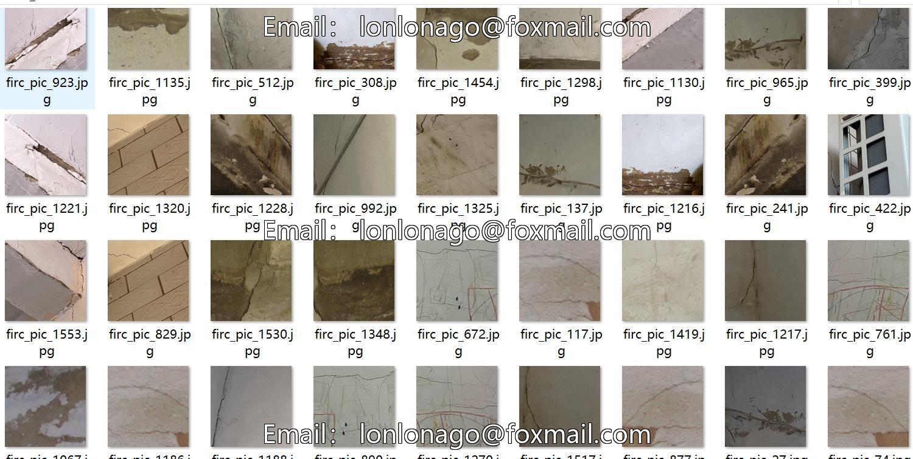
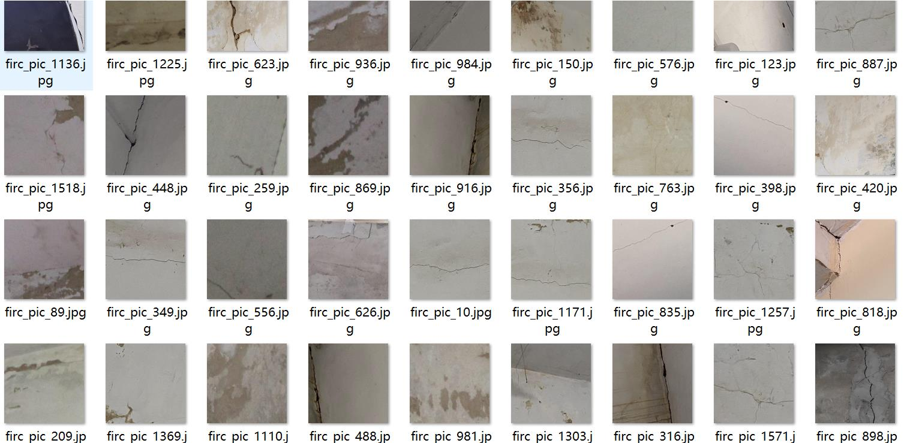
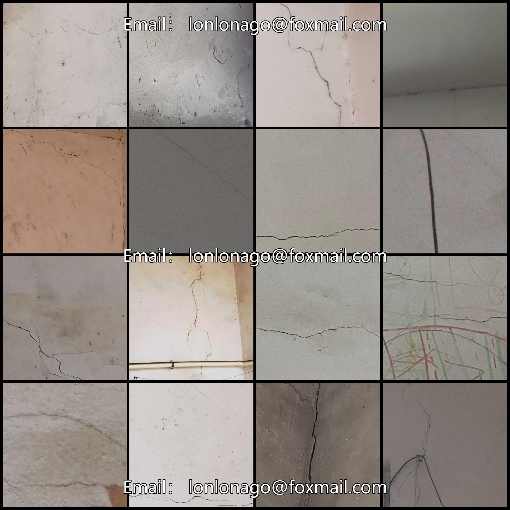
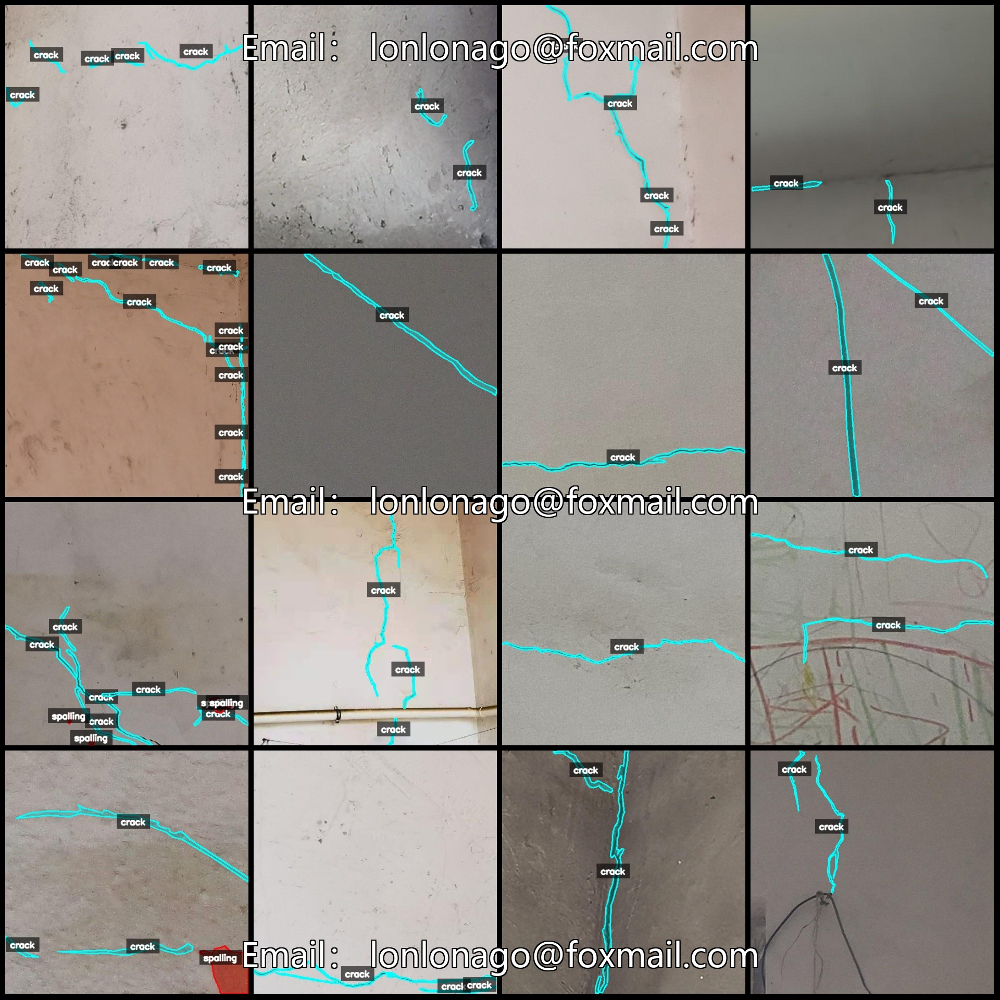
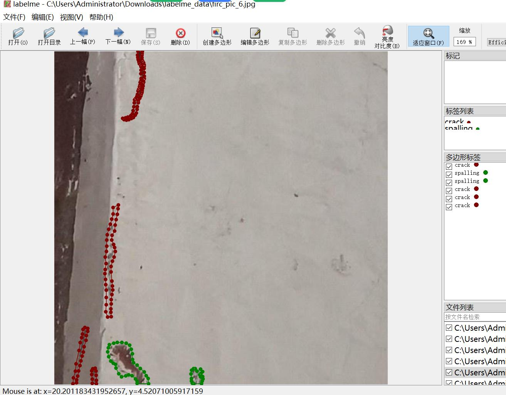

# Building Dataset for Crack and Scaling Identification and Segmentation in Concrete Walls

## Dataset Format: LabelMe Format (Without Mask Files, Only Includes JPG Images and Their Corresponding JSON Files)

### Image Count: Number of JPG Files
- Number of JPG files: 1576

### Annotated Count: Number of JSON Files
- Number of JSON files: 1576

### Number of Annotated Categories: 2
- Annotated category names: ["crack", "spalling"]

### Box Count per Category:
- Crack count = 4119
- Scaling count = 1358
- Total boxes = 5477

### Annotation Tool: LabelMe v5.5.0

### Image Resolution: 512x512

### Annotation Rules: Polygon is drawn around the category

### Important Notice: The dataset can be opened and edited using LabelMe; the JSON dataset needs to be converted into a mask or YOLOF format or COCO format for semantic segmentation or instance 
segmentation.

### Special Declaration: This dataset does not guarantee the accuracy of the trained model or weight files.

### Image Preview:

#### Example of annotating:
- **Randomly selected 16 images**:

#### Example of labelme editing:
- **Edited image example**:

## Image

Here is a pay link on Stripe ( https://buy.stripe.com/3cs8yP7sY87d0vu9AB ). Please contact me lonlonago@foxmail.com after funding $89, and I will send you a complete data files , thank you!

